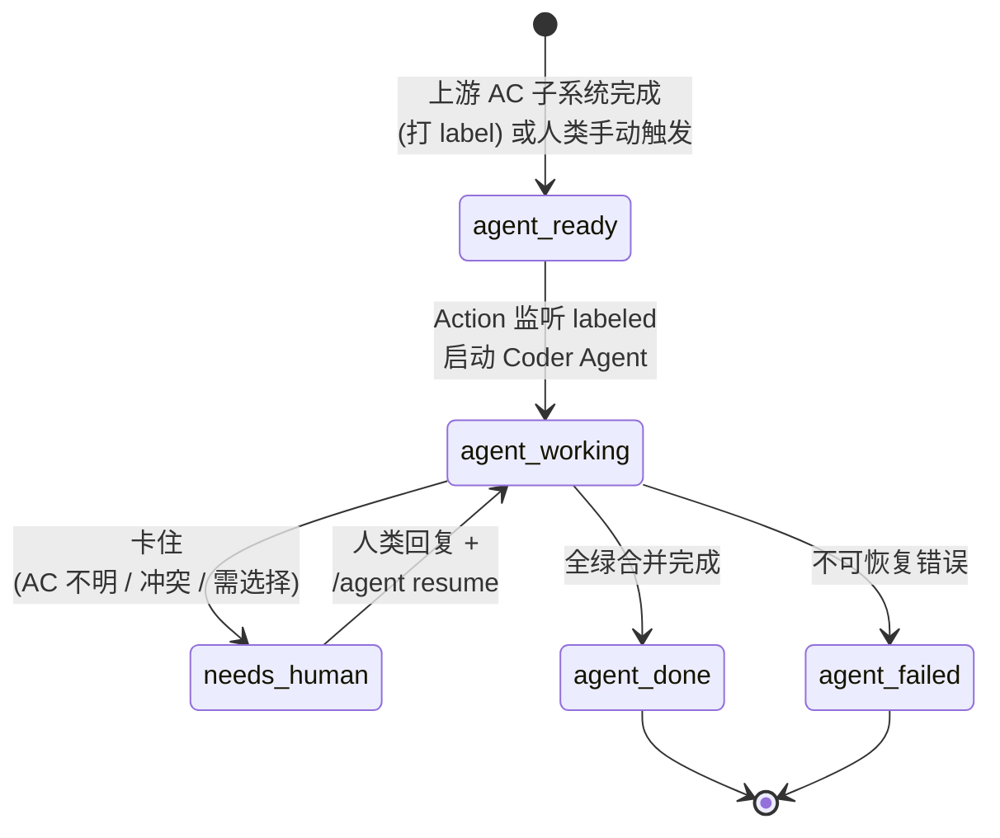
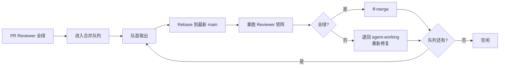

# AI Coding 时代的软件开发工作流设计

## 1. 背景与目标

### 1.1 出发点

在 AI Coding 时代，期望软件开发工作流满足两个核心诉求：

1. **充分自动化**——把人工介入压缩到最少且明确的时机，而不是频繁打断
2. **复用现有基础设施**——基于 GitHub / GitLab 已有的 Issue、PR/MR、Label、CI/CD 能力，不引入额外平台

### 1.2 双模工作流

工作分为两类：

| 维度 | 同步模式（交互式） | 异步模式（批处理） |
|---|---|---|
| 适用场景 | 问题不明确，需对话探索 | 问题已明确定义 |
| 执行载体 | 工程师本地 Claude Code | CI 中运行的 AI Agent |
| 工作区 | 本地 worktree | 独立分支 + PR/MR |
| 人机交流 | 实时对话 | Issue / PR 评论（异步） |
| 人类介入 | 全程参与 | **仅**在 Agent 遇到冲突 / 不一致 / 需要选择时 |

**本文档专注异步批处理通道的设计。** 同步模式不在本规范范围内。

### 1.3 范围边界

**纳入**：

- 任务从 Issue 进入批处理通道后的全生命周期
- Agent 之间、Agent 与 CI 之间的协议
- 多 Agent 并发协作机制
- GitHub 与 GitLab 社区版的实现差异

**不纳入**：

- PRD / Issue / AC 的生成质量保证（属于"上游 AC 子系统"，本规范视为黑盒输入）
- 同步模式下工程师本地 Claude Code 的使用方式
- 模型选型、Prompt 工程的具体策略

### 1.4 核心设计原则

1. **信息隐藏**：外部状态机只暴露"该谁行动"，Agent 内部细节不污染对外接口
2. **标尺一致**：人类与 Agent 的判断依据相同（AC），消除人类后置 review 的信息增量
3. **异构对抗**：多个 Agent 互审时必须异构，避免同型偏差导致"互相点头"
4. **平台无关**：核心规范用抽象术语，平台细节作为附录适配

---

## 2. 准入标准

### 2.1 任务范围

进入批处理通道的任务限于：

| 类别 | 描述 | 示例 | 进通道 |
|---|---|---|---|
| A | 机械型 bug 修复 | "`UserService.findById` 在 id 为负数时抛 NPE，应返回 404" | ✅ |
| B | 接口已定的功能增强 | "给 `/api/users` 加分页参数" | ✅ |
| C | 跨模块的清晰需求 | "新增'用户软删除'，影响 model/service/api/migration" | ✅ |
| D | 探索型 / 技术选型未定 | "给系统加 audit log，方案未定" | ❌（走同步模式） |

### 2.2 AC 契约（上游子系统的输出）

每个 Issue 进入批处理通道前，必须由上游 AC 子系统产出**严谨的 AC**，满足：

- **可机器验证**：每条 AC 有客观判定标准
- **有对应自动化测试**：每条 AC 至少绑定一个测试用例
- **可反向追溯**：每条 AC 能追溯到原始诉求

> AC 的具体格式（Gherkin / 测试代码 / DSL）由上游子系统决定，本规范不锁定。

### 2.3 Coder Agent 的入口契约

**通用模式**：每个 Agent 在工作的第一步是验收"输入契约"。

具体到 Coder Agent，第一步是**验收 AC 是否明确可度量**：

- 满足契约 → 进入正常工作
- 不满足 → 立即进入失败路径（转 `needs-human`），评论说明"AC 哪里不明确"

---

## 3. 状态机与触发

### 3.1 Issue/PR 生命周期状态机



### 3.2 Label 体系（外部状态）

| Label | 含义 | 谁该行动 |
|---|---|---|
| `agent-ready` | AC 就绪，待派发 | Action（启动 Coder Agent） |
| `agent-working` | Agent 正在干活，**人勿扰** | Agent（人观察即可） |
| `needs-human` | 卡住，等人回应 | 人类 |
| `agent-done` | 完成 | 终态：成功 |
| `agent-failed` | 不可恢复 | 终态：失败（事后复盘） |

**强约束**：任意时刻 Issue 上有且仅有一个 `agent-*` label。Action 在状态转换时原子地"摘旧贴新"。

### 3.3 触发模型（Channel A + B）

**Channel A：Label 驱动（声明式）**

人类或上游 AC 子系统打 `agent-ready` label → Action 监听 `labeled` 事件 → 启动 Coder Agent。这是默认触发方式。

**Channel B：评论指令驱动（命令式）**

人类在 Issue/PR 评论中输入指令 → Action 监听 `issue_comment` 事件 → 执行对应动作。这是人类干预通道。

### 3.4 评论指令规范

| 指令 | 含义 | 适用状态 |
|---|---|---|
| `/agent start` | 手动派发（等价于打 `agent-ready` label） | 无 label / 待启动 |
| `/agent resume` | 续上失败路径（必须在人类回复决策后） | `needs-human` |
| `/agent retry` | 强制重启当前阶段 | 任意非终态 |
| `/agent abort` | 终止并打 `agent-failed` | 任意非终态 |
| `/agent escalate` | 强制升级人类（即转 `needs-human`） | 任意非终态 |

### 3.5 关键约束

- **label 切换原子化**：摘旧贴新必须单步完成，不允许出现"两个 `agent-*` label 并存"或"无 `agent-*` label"的中间状态
- **失败路径是一等公民**：任何状态都能转入 `needs-human`
- **`needs-human` 是唯一的人机异步通信状态**：人机对话只发生在该状态下
- **内部细节全部隐藏在 `agent-working`**：AC 验收、编码、PR 创建、Reviewer 矩阵、修复循环、合并都是 Agent 内部行为，对外不可见
- **成功的客观判定**：PR 是否可合并由 Reviewer 矩阵全绿决定（见 §5.5），不依赖 Agent 主观判断

---

## 4. 人机异步通信协议

### 4.1 评论格式：双层结构

Agent 转 `needs-human` 时，必须按"双层格式"写求助评论：**自然语言陈述（人类可读）+ 结构化决策块（机器可解析）**。

**示例模板**：

````markdown
## 🛑 需要人类决策

我在实现 `用户软删除` 功能时遇到一个选择：是否需要保留删除后的用户登录历史。

PRD/AC 中没有明确说明。这个决定会影响数据保留策略和合规性。

```yaml
agent_state:
  stage: coder
  blocker_type: ac_ambiguity
  progress: "完成 model 层 + migration，待 service 层确认行为"

decision:
  question: "软删除用户后，登录历史是否保留？"
  options:
    - id: keep
      desc: "保留全部登录历史（合规友好，需要额外 schema 字段）"
    - id: anonymize
      desc: "保留但脱敏（GDPR 友好）"
    - id: purge
      desc: "硬删除（清爽但不可追溯）"
  custom_allowed: true

resume_instruction: |
  请在评论中明确选择（如 `decision: keep`），然后输入 /agent resume
```
````

### 4.2 结构化块的双重作用

1. **机器可解析**：续上时 Agent 通过解析 YAML 提取上次的问题与人类的回复
2. **Agent 心智状态持久化**：`agent_state` 字段记录 Agent 卡住时的内部状态。续上 = 重新读取评论 = 状态恢复

### 4.3 续上触发：严格命令式

人类回复评论后，**必须显式输入 `/agent resume`** 才触发续上。仅回复评论本身**不**触发。

理由：

- `needs-human` 是低频事件，多打一行命令成本可忽略
- 显式命令避免人类回复一半就误触发
- 多人讨论场景下，避免任何评论都触发
- `/agent resume` 同时是"决策已最终化"的语义信号

### 4.4 续上时的上下文来源

Agent 续上时读取**全部上下文**：

- 评论历史（含上次的求助评论 + 人类回复）
- Issue body（含 AC）
- PR diff
- Commit history

### 4.5 多轮往返

每轮卡住都走同样的 `agent-working → needs-human → /agent resume → agent-working` 循环，没有特殊处理。

---

## 5. Reviewer 矩阵（可信化机制）

> Reviewer 矩阵是 `agent-working` 内部的"质量门禁"。外部只看到 PR 是否合并，不看到 Reviewer 数量、分工、模型选择。本节定义 Reviewer 矩阵的**契约**，不锁定具体实现。

### 5.1 必须覆盖的 review 维度（MUST）

每个维度必须全绿，PR 才允许合并。

| 维度 | 标尺 | 失败的代价 |
|---|---|---|
| **AC Compliance** | PRD/Issue 中的 AC | 漏需求，功能错位 |
| **Test Quality** | 测试真实覆盖 AC、非空 assertion、未篡改 AC、覆盖率达标（具体阈值由项目配置） | 测试假绿，等于无测试 |
| **Security** | OWASP / CodeQL / 公司安全规范 | 漏洞进主干 |
| **Performance** | 性能基线 + SLO（若已建立） | 性能退化 |
| **Consistency** | Lint / 编码约定 / 跨 PR 风格一致性 | 代码库腐化 |
| **Documentation Sync** | API spec / 用户文档 / README 与代码同步 | 文档漂移 |
| **Migration Safety** | DB schema / 数据迁移 / 配置迁移的安全性 | 迁移失败 / 数据损坏 |

> **Migration Safety 的 NoOp 模式**：所有 PR 统一跑 Migration Safety Reviewer。无 schema/迁移变更时直接 PASS（NoOp）。统一门禁简化流水线，避免"今天该跑哪些 Reviewer"的判断逻辑。

### 5.2 可选维度（MAY，按场景配置）

| 维度 | 何时启用 |
|---|---|
| **Compliance** | 受监管场景（SOX / GDPR / HIPAA / 等保） |

### 5.3 异构性约束（反"互相点头"）

Reviewer 必须与 Coder 异构。最低标准：

| 约束 | 类型 | 含义 |
|---|---|---|
| Reviewer ≠ Coder system prompt | **MUST** | 角色 / 价值观 / 输出完全不同 |
| Reviewer ≠ Coder 模型家族 | 推荐 | 跨模型避免同型偏差 |
| **Coder 必须把非显然 WHY 写进代码注释** | **MUST** | 论证成为代码 artifact，被 Reviewer 一并审查 |
| **Reviewer 不读 commit message 中的"自辩"** | **MUST** | 仅看 AC + diff + 测试 + 代码注释 |

> **代码注释作为论证通道**：与"默认不写注释，只在 WHY 不显然时写"原则契合——Coder 主动评估哪些理由必须文档化为永久 artifact。Reviewer 同时审查论证质量（注释是否冗余、是否真有必要）。

#### 关于"矩阵"的实现弹性

本规范定义 Reviewer 矩阵是**逻辑概念**，不锁定物理实现。允许的实现包括：

- **(a) 单 Agent 顺序模式**：一个 Reviewer Agent 在单次会话中按 system prompt 切换，顺序执行各维度审查
- **(b) 单 Agent 并发模式**：一个 Reviewer Agent 通过 subagent（如 Claude Code 的 Agent 工具 / Copilot CLI 的等价机制）并发派发各维度审查，每个 subagent 独立上下文
- **(c) 多进程模式**：多个独立 Reviewer 进程并行（资源充足时使用）

**异构性约束的核心永远是 Coder vs Reviewer 之间**——这条不可放松。跨维度内部是否再异构属于实现选择，但**建议至少做 system prompt 切换**，避免单 agent 长会话内的"自我说服"。模式 (b) 因 subagent 上下文隔离，对自我说服的抗性更强；模式 (a) 资源最省、最易实现，是 MVP 的合理起点。

### 5.4 Blast Radius：调节器（不是 Reviewer）

Blast Radius 评估变更影响半径（核心模块 / 公共接口 / DB schema / 跨服务依赖等），**不直接 PASS/FAIL**，而是调节其他 Reviewer 的严苛度：

- **高风险** → Performance / Security 必跑、不可省；修复循环上限更低；更易升级 `needs-human`
- **低风险** → MAY 维度可跳过；Agent 自决空间更大

### 5.5 合并门禁（进入合并队列的条件）

满足以下**全部条件**时，Coder Agent **将 PR 加入合并队列**（见 §6.2），等待串行合并：

- 所有 MUST 维度全绿
- 已启用的 MAY 维度全绿
- Reviewer 之间无冲突意见

**合并门禁通过 ≠ 立即合并**——队列处理器会再次 rebase + 重跑 Reviewer 矩阵后才执行 ff-merge。这层"队列重审"是为了应对其他 PR 先合并造成的语义漂移。

合并方式：**rebase + fast-forward only**（与 Git Workflow 规范一致，保持线性历史）。

### 5.6 失效升级（Coder Agent 自决）

Coder Agent 在以下情况主动转 `needs-human`：

- 同一 Reviewer 在多轮修复后仍持续红
- Reviewer 之间出现冲突意见（A 要求改、B 要求不改）
- 修复循环 N 轮无收敛
- Reviewer 报告"不在我的能力范围内"

具体阈值由 Coder 根据 Blast Radius 动态决定，**规范不锁定**。

---

## 6. 多 Agent 并发协作

### 6.1 天然隔离

多 Coder Agent 各自工作在不同 Issue 上，每个 Issue 一个独立分支，**git 天然隔离**，无冲突。

### 6.2 合并队列（Merge Queue）

**问题**：多个 PR 几乎同时通过 Reviewer 矩阵请求合并时，rebase 后代码语义可能变化（git 无冲突但行为变了），之前的 review 结果可能失效。

**解决方案**：所有合并请求进入合并队列，**串行处理**：



**核心规则**：

- **进入队列**：PR 通过 §5.5 合并门禁后，由 Coder Agent 加入队列
- **rebase 后必须重跑全部 MUST + 已启用 MAY 维度**：不允许"信任 git rebase 不重审"。任何 rebase 都可能引入语义变化
- **重审失败 → 退回 `agent-working`**：Coder 修复后重新走 5.5 入队
- **永远 ff-merge**：rebase 后保证可 ff，否则不合并

### 6.3 资源管理

资源限流（Runner 容量、API rate limit）属基础设施层，本规范不强制约束，由各平台适配器自行决定。

---

## 7. 跨平台可移植性

### 7.1 抽象层策略

**核心规范用平台无关的抽象术语**；GitHub 和 GitLab 各自实现适配器。核心逻辑不变，只换适配器。

### 7.2 概念映射表

| 抽象概念 | GitHub | GitLab |
|---|---|---|
| 任务单元 | Issue | Issue |
| 变更请求 | Pull Request | Merge Request |
| 状态语言 | Label | Label |
| 自动化执行 | GitHub Actions | GitLab CI/CD |
| 执行环境 | GitHub-hosted / Self-hosted Runner | Shared / Specific Runner |
| **Coder/Reviewer Agent CLI** | **`copilot` (`@github/copilot`)** | **`claude` (Claude Code)** |
| 合并队列 | Merge Queue | Merge Trains（**社区版不可用**，见 §7.5） |
| 评论事件 | `issue_comment` webhook | `Note` webhook |
| 平台 CLI（运维/脚本） | `gh` | `glab` |
| Issue 模板 | `.github/ISSUE_TEMPLATE/` | `.gitlab/issue_templates/` |
| 内置安全扫描 | CodeQL / Dependabot | SAST / DAST / Dependency Scanning |
| 机密管理 | Repository / Org Secrets | CI/CD Variables |
| 工作流身份 | GitHub OIDC | GitLab OIDC |
| Draft 状态 | PR `draft=true` 字段 | MR 标题前缀 `Draft:` |

> **Coder/Reviewer Agent 都是在 Runner 内运行的 CLI 工具**——两个平台架构对称。规范协议（状态机、评论格式、`/agent` 命令、Reviewer 矩阵）在两边 1:1 适用，无需平台特定适配。

### 7.3 关键差异与陷阱

| # | 差异 | 适配建议 |
|---|---|---|
| 1 | Webhook payload 格式不同 | 抽象层规整化为内部事件（`issue.labeled`、`comment.created`），适配器负责解码 |
| 2 | CI YAML DSL 不同 | 工作流逻辑写在 Python/Node 脚本里，CI YAML 只做"触发 + 调脚本" |
| 3 | API rate limit 不同 | 适配器内置限流；过载时降级（Reviewer 矩阵从并行转串行） |
| 4 | 自托管 GitLab Runner 资源稀缺 | 工作流支持降级模式：Reviewer 串行 + 关闭 MAY 维度 |
| 5 | 自托管 GitLab 网络出口受限 | 外部 LLM API 可能被防火墙拦截。预案：本地模型 / 走代理 / 白名单 |

### 7.4 必须规避的 GitHub 专有能力

| 能力 | 替代方案 |
|---|---|
| GitHub Projects v2 | 用 label + Issue 关联 |
| **GitHub Copilot Coding Agent**（云托管） | 使用 **Copilot CLI** 在 Action Runner 中运行（行为可控，与 GitLab 对称） |
| GitHub Copilot Workspace | 通用 AI Agent 框架（Claude Code / 自研） |
| GitHub Codespaces | 不依赖云端开发环境 |
| GitHub Discussions | 关键讨论统一进 Issue |
| GitHub Marketplace Actions | 只用第一方/自写 action，或 docker image 跨平台 |

> **Copilot CLI vs Copilot Coding Agent**：托管的 Coding Agent 行为不可控，会破坏规范协议（评论格式、`/agent` 命令、AC 入口验收）；CLI 则是普通命令行工具，跑在我们自己的 Runner 中，与 Claude Code 在 GitLab 上的角色对称。**本框架的 GitHub 实现强制使用 CLI**。

### 7.5 GitLab 社区版（CE）适配

社区版**不支持 Merge Trains**，需要脚本实现串行合并：

**实现要点**：

1. **队列状态用 label 表达**：增加 `merge-queued` label 表示"已通过 Reviewer，等待入队合并"
2. **GitLab CI 资源组**（`resource_group`）保证串行：
   ```yaml
   merge_job:
     resource_group: production_merge_queue
     script:
       - python merge_queue_processor.py
   ```
3. **队列处理器脚本**：
   - 通过 GitLab API 查询所有带 `merge-queued` label 的 MR
   - 按创建时间排序取队首
   - rebase → 重跑 Reviewer 矩阵 → ff-merge → 处理下一个
   - 失败的 MR 移除 `merge-queued` label，回到 `agent-working`
4. **触发方式**：
   - PR 通过 Reviewer 后打 `merge-queued` label → CI pipeline 触发
   - `resource_group` 保证全队列同时只有一个 job 运行

**其他 CE 注意事项**：

- API rate limit 取决于 instance 配置，需要测试容量
- LLM API 出口需要打通（防火墙白名单 / 代理 / 本地部署模型）
- Runner 容量需要评估：典型场景下 Reviewer 矩阵 7 个维度并行 → 至少 7 个并发 Runner
- CI/CD Variables 必须区分 Protected / Masked，避免 LLM API key 泄露到 job 日志

---

## 8. 附录

### 8.1 Issue 模板示例（统一）

```markdown
## 任务类型
- [ ] A - 机械型 bug 修复
- [ ] B - 接口已定的功能增强
- [ ] C - 跨模块清晰需求

## 原始诉求
（人类描述，自然语言）

## AC（由上游子系统填充，不要手动填写）
<!-- ac:start -->
<!-- ac:end -->

## 关联 PRD / 文档
（链接）
```

### 8.2 求助评论模板（双层格式）

见 §4.1 示例。Agent 实现时强制使用此模板。

### 8.3 状态转换矩阵

| 当前状态 | 触发事件 | 新状态 | 副作用 |
|---|---|---|---|
| (none) | label `agent-ready` 添加 | `agent-ready` | 等待 Action 启动 |
| `agent-ready` | Action 启动 Coder | `agent-working` | 创建分支、启动 job |
| `agent-working` | Coder 报告"卡住" | `needs-human` | 写求助评论 |
| `needs-human` | 评论 `/agent resume` | `agent-working` | 启动 Coder（带评论上下文） |
| `agent-working` | Coder 报告"已合并" | `agent-done` | 关闭 PR & Issue |
| `agent-working` | Coder 报告"不可恢复" | `agent-failed` | 写错误说明 |
| 任何非终态 | 评论 `/agent abort` | `agent-failed` | 强制终止 |
| 任何非终态 | 评论 `/agent escalate` | `needs-human` | 转交人类 |

### 8.4 Reviewer 矩阵典型实现（参考）

| 维度 | 典型实现 |
|---|---|
| AC Compliance | LLM Reviewer Agent，输入 AC + diff + tests，输出 PASS/FAIL + 理由 |
| Test Quality | LLM Reviewer Agent + 静态分析（如 mutation testing） |
| Security | CodeQL / SAST + LLM Reviewer 二次审查 |
| Performance | 基线对比脚本 + LLM Reviewer 解读 |
| Consistency | Lint + LLM Reviewer 跨 PR 风格审查 |
| Documentation Sync | LLM Reviewer 对比 API spec / README / 用户文档 |
| Migration Safety | LLM Reviewer + dry-run 迁移脚本 |

---

## 9. 待办与遗留

### 9.1 已收口
- ✅ 准入标准与 AC 契约
- ✅ 状态机与 Label 体系
- ✅ 触发模型（Channel A + B）
- ✅ 评论格式与续上机制
- ✅ Reviewer 矩阵契约
- ✅ 合并队列策略
- ✅ 跨平台映射

### 9.2 留给实现阶段
- Reviewer Agent 的具体 prompt 设计
- 修复循环上限的具体阈值（按 Blast Radius）
- 上游 AC 子系统的实现（独立子项目）
- 失败 Issue 的复盘流程
- 监控与可观测性（如何度量"自动化率"、"误升级率"）

### 9.3 后续可能演进
- 支持"PR 之间的依赖关系"（Issue A 必须在 Issue B 之前合并）
- 支持"feature flag 自动管理"（高风险变更默认带 flag）
- 引入"Coder Agent 池"概念，按任务类型分配不同特长的 Agent
