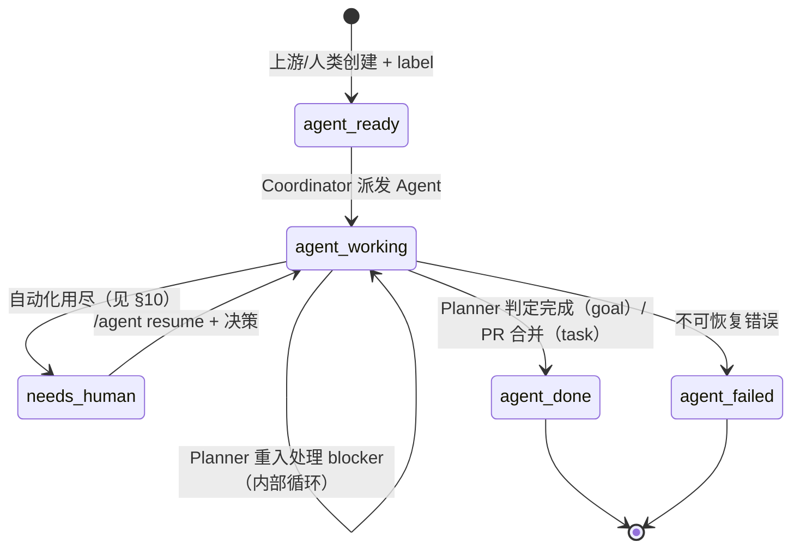

# ai-flow 设计文档

## 1. 背景与目标

### 1.1 出发点

GitHub / GitLab 已经提供了一个异步任务系统所需的全部基础设施：

- **代码托管** = 基于文件的持久化存储
- **Issue** = 异步消息传递机制（支持 webhook、label、comment）
- **PR / Workflow / Pipeline** = 异步任务执行 + CI 门禁

ai-flow 把这些原生能力当作底座，构造一个**递归任务分解 + 多 Agent 协作**的软件开发自动化系统。它是先前 `software-workflow` 项目的继任者：继承经验教训，但在递归任务树这一核心抽象上重写。

### 1.2 与先前 software-workflow 的关系

`software-workflow` 解决了：一个 Issue + 一段 AC → 一个 PR → Reviewer 矩阵 → ff-merge。它把"如何拆解 AC"视为黑盒上游。

ai-flow 把"上游 AC 子系统"那一层显式化为 **Planner Agent**：递归地把根目标拆成子任务，每个叶子任务进入 software-workflow 那套循环。

```
ai-flow = Planner（任务树） + 继承 software-workflow 的叶子执行层
```

继承的设计（详见 §13）：
- 5 状态外部状态机（"暴露谁该行动"原则）
- Comment 双层格式
- `/agent` slash 命令协议
- Reviewer 矩阵（7 维度 + heterogeneity 约束）
- Channel 纪律（Reviewer 不读 commit message）
- Merge queue（label-driven + 串行 + rebase 后重审）
- emit() metrics（never raises）
- Fake/Real 测试拆分

新增的设计（详见对应章节）：
- Planner 角色 + 递归任务分解
- 任务树 + manifest + task_id 稳定身份
- Planner 三段仲裁（Reviewer 死锁兜底）
- failed-env 分类重试 + 树级 throttle
- agent `/ask` ↔ 人 `/agent decide` 配对
- Cost observability（无预算控制）

### 1.3 双模工作流（继承 software-workflow §1.2）

工作分为两类：

| 维度 | 同步模式（交互式） | 异步模式（批处理） |
|---|---|---|
| 适用场景 | 问题不明确，需对话探索 | 问题已经/可被自动定义 |
| 执行载体 | 工程师本地 Claude Code | CI 中的 Agent |
| 工作区 | 本地 worktree | task branch + PR |
| 人机交流 | 实时对话 | Issue / PR 评论 |
| 人类介入 | 全程 | 仅在 Agent 用尽自动化手段后 |

**本规范专注异步批处理通道**，且这一通道现在覆盖**从根目标到所有叶子任务的递归分解**，而非只覆盖单一 Issue。

### 1.4 范围边界

**纳入**：
- 根目标 → 任务树 → 叶子任务的全生命周期
- Planner / Implementer / Reviewer 之间、Agent 与 CI 之间的协议
- 多 Agent 并发的协调机制
- GitHub-first，GitLab CE 适配预留

**不纳入**：
- 模型选型与具体 Prompt 工程策略
- PRD / 需求文档的生成（视为根目标的人类输入）
- 同步模式

### 1.5 核心设计原则

1. **信息隐藏**：外部状态机只暴露"谁该行动"，所有 Agent 内部状态藏在 Issue body YAML 里
2. **Reconciler 范式**：Planner 是反应式 reconciler，每次重入读全量状态，输出全量期望状态
3. **Channel 纪律**：每种 artifact 有明确受众，Reviewer 不被自陈的输出影响
4. **异构对抗**：Reviewer ≠ Implementer system prompt；多维度互不可见
5. **Fail-closed**：缺 marker、解析失败、状态不合法 → 立即失败，不靠默认值兜底
6. **平台无关核心**：核心规范用抽象术语，平台细节作为适配器

---

## 2. 准入与角色模型

### 2.1 任务范围

进入 ai-flow 的根目标限于：

| 类别 | 描述 | 示例 | 进通道 |
|---|---|---|---|
| A | 软件功能开发 | "给 REST API 加 rate limiter" | ✅ |
| B | Bug 修复 | "`UserService.findById(-1)` 抛 NPE" | ✅ |
| C | 跨模块清晰需求 | "新增'用户软删除'，影响 model/service/api/migration" | ✅ |
| D | 重构 / 性能优化（目标可度量） | "把 `/api/users` 列表 P95 降到 200ms" | ✅ |
| E | 探索型 / 技术选型未定 | "给系统加 audit log，方案未定" | ❌ 走同步模式 |

### 2.2 根目标的输入契约

人类创建 `type:goal` Issue 时填写：

```markdown
## 任务类型
- [x] A — 软件功能开发

## 目标描述
（要达成什么 — 1-3 句话）

## 背景上下文
（为什么 / 现状 / 关联系统）

## 约束条件
（不能动的边界 / 必须遵守的规则 / 时间或资源约束）

## 期望产物
（完成的样子 — 用户可观察到什么变化）
```

模板**不强制要求 AC**——AC 由 Planner 在拆解时为每个叶子任务生成（落到 `task.spec.quality_criteria`）。

### 2.3 角色清单

ai-flow 共 **3 个 LLM Agent + 1 套水管**：

| 角色 | 类型 | 职责 |
|---|---|---|
| **Planner** | LLM Agent | 递归分解、任务树 reconcile、仲裁 review 死锁、判定 goal 完成 |
| **Implementer** | LLM Agent | 按 spec 实现单个叶子任务，开 PR |
| **Reviewer** | LLM Agent（× 7 维度） | 对 PR 做异构维度审查，输出 verdict |
| **Coordinator** | Python 派发逻辑 | 解析事件、派发 Agent、apply reconciler 副作用、失败重试。**不是 LLM，不是单独的 Agent。** |

Coordinator 是工作流脚本本身——主分支事件触发 → workflow 跑 → 调 `flow dispatch` → 路由到合适的 Agent 或副作用。

### 2.4 Agent CLI 选型

继承 software-workflow §7.2：

| 平台 | Agent CLI | 安装 |
|---|---|---|
| GitHub | `copilot`（`@github/copilot`） | `npm install -g @github/copilot` |
| GitLab | `claude`（Claude Code） | `npm install -g @anthropic-ai/claude-code` |

抽象层用 `AgentClient` duck-typed 接口：

```python
class AgentClient(Protocol):
    def run(
        self,
        prompt: str,
        cwd: Path,
        env: dict[str, str],
        timeout: int,
        check: bool = False,
    ) -> subprocess.CompletedProcess: ...
```

实现：`CopilotCliClient`、`ClaudeCodeClient`。Planner / Implementer / 7 个 Reviewer 维度都用同一个 client，区别只在 system prompt。

---

## 3. 状态机与 Label 体系

### 3.1 设计原则：外部状态只暴露"谁该行动"

详细的内部状态（review iteration、blocker 子分类、failed-env category）**全部下沉到 Issue body YAML 的 `agent_state` 字段**，不用 label 表达。这避免 label 维度爆炸，也让 GitHub/GitLab 的 label 视图保持干净。

### 3.2 Label 集合

```
外部状态（每个 Issue 必须有且仅有一个）：
  agent-ready       可被派发，等 Coordinator
  agent-working     某个 Agent 在干，人勿扰
  needs-human       自动化用尽，等人类指令
  agent-done        终态：成功
  agent-failed      终态：不可恢复

辅助 label：
  merge-queued      PR 入队等 ff-merge
  type:goal         根目标 Issue
  type:task         任务节点 Issue
```

总共 **7 个 label**。`type:*` 可以并存于状态 label。

### 3.3 状态机



**关键性质**：
- `agent-working → agent-working` 是合法自循环（Planner 内部多次 reconcile，外部观察不到状态变化）
- 所有 blocker（conflict / dep_unmet / failed_env / review_fail）**默认不暴露到外部 label**——Planner 处理掉就还是 `agent-working`，处理不了才升 `needs-human`
- `merge-queued` 是 task PR 上的 label，与状态 label 正交（同时存在于 PR 上）

### 3.4 转移表

| 当前状态 | 触发 | 新状态 | 副作用 |
|---|---|---|---|
| (none) | label `agent-ready` 添加 | `agent-ready` | 待 Coordinator |
| `agent-ready` | Coordinator 派发 Agent | `agent-working` | 启动 sandbox |
| `agent-working` | Planner reconcile 完成（无新 blocker） | `agent-working` | manifest 更新 |
| `agent-working` | Planner 判定 goal 完成 | `agent-done` | 关闭 Issue |
| `agent-working` | Implementer/Reviewer/Planner 报 needs-human | `needs-human` | 写双层 comment |
| `agent-working` | 不可恢复错误 | `agent-failed` | 写错误说明 |
| `needs-human` | comment `/agent resume` | `agent-working` | 重派对应 Agent |
| `needs-human` | comment `/agent decide <id>` | `agent-working` | 决策注入 prompt |
| 任意非终态 | comment `/agent abort` | `agent-failed` | 强制终止 |
| 任意非终态 | comment `/agent escalate` | `needs-human` | 转交人类 |
| 任意非终态 | comment `/agent retry` | `agent-working` | 重启当前阶段 |
| `agent-ready` | comment `/agent replan [hint]` | `agent-working` | 派 Planner 重做 |
| `needs-human` | comment `/agent replan [hint]` | `agent-working` | 派 Planner 重做 |

### 3.5 Label 切换原子化

GitHub Issue API 不支持事务，参照 software-workflow 的实现：**计算最终 label 集合，单 PUT replace-all**。

```python
def set_state_label(issue, new_state: str):
    new_labels = [l for l in issue.labels if l not in EXTERNAL_STATES] + [new_state]
    issue.edit(labels=new_labels)   # 单次 API 调用
```

不允许中间出现"两个状态 label 并存"或"无状态 label"。

---

## 4. 任务树与 Manifest

### 4.1 任务节点关系

```
type:goal  Issue (#1)
    │
    ├─ child  type:task  Issue (#2)  task_id: T-pick-lib
    ├─ child  type:task  Issue (#3)  task_id: T-impl-mw    deps: [T-pick-lib]
    │     │
    │     └─ child  type:task  Issue (#7)  task_id: T-reorder-mw  （Planner 后增）
    ├─ child  type:task  Issue (#4)  task_id: T-add-config  deps: [T-pick-lib]
    └─ ...
```

任务树是**有向无环图（DAG）**：节点是 Issue，边有两种：
- `parent / children`（树骨架）
- `deps`（横向依赖，限制执行顺序）

每个非根节点必须有恰好 1 个 parent；可以有 0 或多个 deps（指向兄弟或祖辈分支）。

### 4.2 task_id 稳定身份

Issue number 由平台分配且不连续；ai-flow 引入 `task_id`：

- 格式：`T-<slug>`（语义化，例：`T-pick-lib`、`T-impl-rate-mw`）
- 由 Planner 在创建任务时分配，**写入即不可改**
- 必须在该 goal tree 内唯一
- 用于 manifest、deps、Implementer/Reviewer prompt 内部引用

### 4.3 Manifest（在根 goal Issue body）

Manifest 是任务树的**结构 + 身份映射表**，存在根 goal Issue 的 body YAML 中。Planner 是它的唯一写者。

```yaml
---
schema_version: 1
manifest:
  - { task_id: T-pick-lib,    issue: 2, deps: [], state: agent-done }
  - { task_id: T-impl-mw,     issue: 3, deps: [T-pick-lib], state: agent-working }
  - { task_id: T-reorder-mw,  issue: 7, deps: [], state: agent-working,
      parent_task_id: T-impl-mw }
  - { task_id: T-add-config,  issue: 4, deps: [T-pick-lib], state: agent-done }
  - { task_id: T-tests,       issue: 5, deps: [T-impl-mw], state: agent-ready }
  - { task_id: T-docs,        issue: 6, deps: [T-impl-mw], state: agent-ready }
agent_state:
  stage: planning
  last_planner_run: "2026-04-29T10:23:00Z"
  planner_iteration: 4
  dispatch_lock: null              # 应用层锁，见 §9.2
---

（人类在这里写目标描述、背景、约束、期望产物 — 不被机器解析）
```

`manifest[*].state` 是**Planner 视角的快照**——不是真相源（真相源是各子 Issue 的 label）。Planner 重入时**先校验** manifest 中的 state 与各子 Issue 当前 label 一致，不一致则同步。

### 4.4 任务节点 Issue 的 body schema

每个 `type:task` Issue 的 body 也是 YAML + Markdown：

```yaml
---
schema_version: 1
task_id: T-impl-mw
goal_issue: 1
parent_task_id: null              # null 表示直接挂在根 goal 下
spec:
  goal: "实现 rate limiter middleware"
  constraints:
    preconditions: ["JWT 库已选型"]
    capabilities: [module:rate-limit]
  quality_criteria:
    - "全部相关测试通过"
    - "覆盖典型限流场景：超阈值 429、突发流量"
  steps:
    - { id: s1, description: "替换 token 签发逻辑", status: done }
    - { id: s2, description: "更新中间件注册顺序", status: pending }
deps: [T-pick-lib]
artifacts:
  - { type: pr, ref: 89, merged: false }
  - { type: branch, ref: "task/T-impl-mw" }
review:
  iteration: 1
  max_iterations: 5                # 可被 spec 或 config override
  history:
    - { iter: 1, verdict: fail, failed_dimensions: [consistency], comment_id: ... }
agent_state:
  stage: implementer | reviewer | blocked
  blocker_type: null | spec_ambiguity | cross_module_conflict | dep_unmet
              | impl_review_deadlock | failed_env | ask
  blocker_details: { ... }
  failed_env:                       # 仅 blocker_type=failed_env 时填
    category: model_5xx | rate_limit | sandbox_oom | quota | tool_error | infra
    attempts: 2
    last_attempt: "..."
    next_attempt: "..."
    history: [...]
---

# Implementer 自陈摘要（由 Implementer 在每轮结束写入，给 Planner 看，不进 PR）
（Implementer 写）
```

---

## 5. Planner 层

### 5.1 调用契约

Planner 是**纯函数式 subprocess**：input → 结构化 output。Planner **不**直接修改 Issue / PR / label，由 Coordinator 解析 output 后执行副作用。这与 Implementer/Reviewer 的纪律完全对称。

```
事件 → workflow → Coordinator
                    ├─ 找到 root goal
                    ├─ 检查是否需要 Planner（§5.2）
                    ├─ 构建 input bundle
                    ├─ 写 /tmp/planner-G<id>/input.yaml
                    ├─ Agent CLI 跑 Planner（带 system prompt + input）
                    ├─ Planner 写 /tmp/planner-G<id>/result.yaml
                    └─ Coordinator 解析 result，apply 到 Issue 树
```

### 5.2 Planner 调用条件（Coordinator 决定）

并非每个事件都派 Planner。Coordinator 先做 cheap check：

| 触发事件 | 派 Planner？ |
|---|---|
| `type:goal` Issue 初次 `agent-ready` | ✅ initial |
| 子任务 `agent-working → agent-done` | ✅ child_done |
| 子任务 `agent-working → agent-failed` | ✅ child_done（替代方案 / 终止） |
| 子任务 body `agent_state.blocker_type` 非空（非 ask / 非 failed_env） | ✅ child_blocker |
| 子任务 review.iteration ≥ 3 | ✅ review_arbitration |
| 任意 Issue `/agent replan [hint]` | ✅ replan_command |
| 子任务 PR merged | ✅ child_done（更新 manifest） |
| 子任务 in-flight 期间的 push / 普通 comment | ❌ |
| `agent_state.blocker_type == ask` | ❌（直接转 needs-human） |
| `agent_state.blocker_type == failed_env` 重试中 | ❌（按重试机制走） |

### 5.3 Input Bundle Schema

```yaml
# /tmp/planner-G0001/input.yaml
schema_version: 1
invocation_reason: initial | child_done | child_blocker | replan_command | review_arbitration

goal:
  issue: 1
  title: "..."
  body_prose: "..."                # 去掉 yaml block 后的人类描述
  manifest: [...]                  # 上一次 Planner 留下的 plan
  authoring_user: "<github_handle>"

children:
  - issue: 2
    task_id: T-pick-lib
    state_label: agent-done
    spec: { ... }
    artifacts: [{ type: pr, ref: 12, merged: true }]
    blocker: null
    recent_comments: []            # 仅 blocker / needs-human 时填，最近 5 条
  - issue: 3
    task_id: T-impl-mw
    state_label: agent-working
    spec: { ... }
    blocker:
      type: cross_module_conflict
      message: "..."
      raised_by: implementer
      details: { affected_capabilities: [module:auth] }
    recent_comments: [...]

# 仅 invocation_reason: review_arbitration
arbitration_context:
  task_id: T-impl-mw
  iteration: 3
  history:
    - { round: 1, implementer_summary, reviewer_verdicts, pr_diff_excerpt }
    - { round: 2, ... }
    - { round: 3, ... }

# 仅 invocation_reason: replan_command
replan_hint: "用户要求改方向 X"
replan_target: goal | T-impl-mw    # 在哪个 Issue 上发的命令

repo_context:
  primary_language: python
  has_tests: true
  recent_commits: [...]
  file_tree_top: [...]
```

### 5.4 Output Schema

```yaml
# /tmp/planner-G0001/result.yaml
schema_version: 1
status: ok | blocked | done

# status == ok（正常一轮 reconcile）
desired_plan:                       # 全量期望状态，不是 diff
  - task_id: T-pick-lib
    spec: { ... }
    deps: []
    parent_task_id: null
  - task_id: T-impl-mw
    spec: { ... }
    deps: [T-pick-lib]
  - task_id: T-reorder-mw
    spec: { ... }
    deps: []
    parent_task_id: T-impl-mw

actions:                            # 显式动作，从 desired 推不出来的副作用
  modify_specs:
    - task_id: T-impl-mw
      reason: "review iter 3 显示 quality_criteria 含糊"
      patch:
        quality_criteria: [...]
      reset_review_iteration: true
  override_review:
    - task_id: T-impl-mw
      verdict: pass | fail
      reason: "..."
  cancel_tasks: [T-orphan]

# status == blocked
blocker:
  question: "..."
  options: [{ id, desc }]
  custom_allowed: true
  agent_state:
    stage: planner
    blocker_type: goal_too_vague | conflicting_constraints | external_decision_needed

# status == done
summary: |
  完成。产物：
  - PR #12 (T-pick-lib): 选型 ADR
  - PR #45 (T-impl-mw): middleware 实现
  ...
```

### 5.5 Reconciler 算法

```python
def reconcile(planner_result, root_goal, current_tree, gh):
    if planner_result.status == "blocked":
        gh.comment(root_goal, build_needs_human_comment(planner_result.blocker))
        gh.set_state_label(root_goal, "needs-human")
        emit("planner_blocked", goal=root_goal.number)
        return

    if planner_result.status == "done":
        # Hard guard：不允许有非终态子任务时宣布 done
        if any(c.state_label not in ("agent-done", "agent-failed")
               for c in current_tree.children):
            emit("planner_false_done", goal=root_goal.number)
            gh.comment(root_goal, "Planner 错误地宣布 done，但仍有 in-flight 任务")
            gh.set_state_label(root_goal, "needs-human")
            return
        gh.comment(root_goal, planner_result.summary)
        gh.set_state_label(root_goal, "agent-done")
        gh.close_issue(root_goal)
        return

    # status == ok
    desired = {t.task_id: t for t in planner_result.desired_plan}
    observed = {c.task_id: c for c in current_tree.children}

    # 1) 创建新任务
    for task_id, t in desired.items():
        if task_id not in observed:
            new_issue = gh.create_child_issue(root_goal, task_id, t.spec, t.deps,
                                              t.parent_task_id)
            update_manifest(root_goal, add=(task_id, new_issue.number, t.deps,
                                            t.parent_task_id))

    # 2) 更新已有任务的 spec
    for task_id, t in desired.items():
        if task_id in observed and spec_drifted(observed[task_id].body_yaml, t.spec):
            gh.update_issue_body(observed[task_id], merge_spec(t.spec))

    # 3) 取消 desired 里没有的（终态除外）
    for task_id, child in observed.items():
        if task_id not in desired and child.state_label not in TERMINAL_STATES:
            cancel_task(child, gh)

    # 4) 显式 actions
    for spec_patch in planner_result.actions.modify_specs or []:
        apply_spec_patch(spec_patch, gh)
    for override in planner_result.actions.override_review or []:
        apply_review_override(override, gh)
    for task_id in planner_result.actions.cancel_tasks or []:
        if task_id in observed:
            cancel_task(observed[task_id], gh)

    # 5) 更新 manifest 元数据
    bump_manifest_metadata(root_goal)
```

幂等性来自 set-based 操作（步骤 1-3）。Planner 崩溃留下的不完整状态，下次重入自动收敛。

### 5.6 三段升级与仲裁

review_fail 的处理由 review.iteration 计数驱动：

| iteration | 处理 |
|---|---|
| 1, 2 | Coordinator 直接重派 Implementer，**新会话**带 spec + 上一轮 verdict comment |
| 3 | Planner 介入仲裁（invocation_reason=review_arbitration） |
| > max_iterations（默认 5） | 转 needs-human |

#### Planner 仲裁的 5 选 1：

仲裁时 Planner 必须输出五种之一：

1. **修 spec**：quality_criteria 模糊 → `actions.modify_specs` + `reset_review_iteration: true`
2. **改 Implementer 路线**：方法偏了 → 加 hint 到 `spec.steps`，重置 iteration
3. **最后一击**：spec 没问题，给最后一次提示，**不重置** iteration（等于"再不过就 human"）
4. **Reviewer override**：判定 Reviewer 错了 → `actions.override_review`，verdict=pass
5. **escalate**：判不了 → `status: blocked`

**仲裁也有上限**：同 task 的 review_arbitration 默认 ≤ 2 次。两次仲裁后还没过 → 强制 needs-human。这避免 Planner 自己陷入"反复仲裁但任务永远过不了"的二级死锁。

### 5.7 goal 完成判定

`status: done` 的硬 + 软条件：

**硬条件**（Reconciler 校验，不满足直接拒绝）：
- 所有 manifest 中任务的 `state_label ∈ {agent-done, agent-failed}`
- result 中没有 `actions.modify_specs` / `cancel_tasks`（否则 Planner 自相矛盾）

**软条件**（Planner 自己判断）：
- 看 `goal.body_prose` 与 children 的 artifacts，目标真的达成
- partial success 时，summary 必须明示哪些子任务 failed、为什么不影响整体

软条件失败 → fail-closed 转 needs-human，让人类裁决。

### 5.8 Planner 的能力边界

| 能力 | 允许 |
|---|---|
| 读 cloned repo 文件 | ✅ |
| 读 input bundle | ✅ |
| 调 LLM | ✅ |
| 写 result.yaml | ✅ |
| 调 GitHub API（issue/PR/label） | ❌ |
| `git push` | ❌ |
| 修改 main 上的代码文件 | ❌ |

只读 + 输出 YAML 让 Planner 完全可测试（fixture in / yaml out）。

---

## 6. Implementer 层

### 6.1 Input Bundle

```yaml
# /tmp/implementer-T-impl-mw/input.yaml
schema_version: 1
invocation_reason: initial | review_fail_retry | failed_env_retry

task:
  issue: 3
  task_id: T-impl-mw
  spec:
    goal: "..."
    constraints: { ... }
    quality_criteria: [...]
    steps: [...]
  branch: task/T-impl-mw

prior_review_history:                # invocation_reason=review_fail_retry 时填
  - { iteration: 1, verdict: fail, failed_dimensions: [consistency],
      reviewer_comment_excerpt: "..." }

parent_context:
  goal_title: "..."
  goal_body_prose: "..."

sibling_artifacts:                   # 已 done 的兄弟任务
  - { task_id: T-pick-lib, pr: 12, summary: "选型 token-bucket，库 @acme/limiter" }

repo_context:
  primary_language: python
  base_branch: main

channel_discipline:
  write_why_in_code_comments: true
  reviewer_input_excludes: [commit_message, pr_description, implementer_summary]
```

### 6.2 System Prompt 关键段落

```
You are an Implementer agent. You produce a working code change for a 
single well-specified task.

CHANNEL DISCIPLINE (HARD constraint):
You produce four categories of artifacts, each with its own audience:

1. Code + comments       → Reviewer reads. Put non-trivial WHY here.
2. PR description        → humans read (review/release-notes/audit).
                          Reviewer agents will NOT read it.
3. Commit message        → humans/tooling read (conventional commits).
                          Reviewer will NOT read.
4. .agent/result.yaml    → Planner reads (brief self-summary).

VALIDATE INPUT CONTRACT FIRST:
Read task.spec.quality_criteria. If they are too vague or contradictory 
to be testable → status: blocked, type: spec_ambiguity, do NOT start coding.

STAY WITHIN CAPABILITIES:
spec.constraints.capabilities lists which modules you may modify.
If you discover the task requires touching modules outside this list, 
STOP and report status: blocked, type: cross_module_conflict, listing 
the affected_capabilities. Do NOT silently expand scope.

OUTPUT MARKER:
Write .agent/result.yaml at end of session. Missing → fail-closed.
```

### 6.3 Output Schema

```yaml
# .agent/result.yaml
schema_version: 1
status: done | blocked

# status == done
artifacts:
  branch: task/T-impl-mw
  pr_opened: true
  summary: |
    实现要点（自陈，给 Planner 看，不进 PR）：
    - 用 token-bucket 算法
    - middleware 注册到 ...
    - 测试覆盖 ...

# status == blocked
blocker:
  type: spec_ambiguity | cross_module_conflict | dep_unmet
      | tool_error | model_error | ask
  message: "..."
  details:
    affected_capabilities: [module:auth]    # cross_module_conflict
    missing_dep_task_id: T-pick-lib         # dep_unmet
    suggested_action: "..."
  # type: ask
  question: "..."
  options: [{ id, desc }]
  custom_allowed: true
  agent_state:
    stage: implementer
    progress: "完成 token bucket 实现，卡在 auth middleware 顺序问题"
```

### 6.4 Coordinator 路由

| Implementer result | Coordinator 行动 |
|---|---|
| `status: done` + PR 存在 | task body 写 `agent_state.stage: reviewer` → 派 Reviewer 矩阵 |
| `status: done` + PR 不存在 | failed-env (`subprocess_error`) |
| 无 result.yaml | failed-env (`no_result_marker`) |
| `blocker.type` ∈ {spec_ambiguity, cross_module_conflict, dep_unmet} | task body 写 blocker → 派 Planner |
| `blocker.type == ask` | task → `needs-human`，写双层 comment |
| `blocker.type` ∈ {tool_error, model_error} | failed-env 重试机制 |

**关键**：除了 `ask`，Implementer 不直接转 needs-human。所有可机器修复的 blocker 先经 Planner，这是相对 software-workflow 的最大变化（先前 software-workflow 没有 Planner 兜底，所有 blocker 直接转 needs-human）。

### 6.5 PR 内容约定

**PR description**（Implementer 必写，正常软件工程标准）：

```markdown
## Summary
（变更摘要，1-3 句）

## Motivation / Context
（为什么要做这个改动 — 给人类 reviewer/未来考古者看）

## Changes
- 改动 1
- 改动 2

## Testing
（如何验证 — 测试覆盖、手动验证步骤）

## Closes
Closes #3
```

**Commit message**：conventional commits 风格（`feat:`, `fix:`, `refactor:`）。

**Reviewer 不会读** PR description 和 commit message。所有"为什么这样写"的论证必须落到代码注释里。

---

## 7. Reviewer 矩阵

### 7.1 矩阵结构

每个 PR 跑 7 个独立 Reviewer subprocess，每个写 `.review/<dim>.yaml`：

| 维度 | 标尺来源 | 必选 | NoOp 条件 |
|---|---|---|---|
| **Spec Compliance** | task.spec.quality_criteria | MUST | — |
| **Test Quality** | 真实覆盖、非空 assertion、未篡改、覆盖率 | MUST | — |
| **Security** | OWASP / CodeQL / 项目安全规范 | MUST | — |
| **Consistency** | Lint + 跨 PR 风格 | MUST | — |
| **Migration Safety** | DB schema / 数据迁移 | MUST | 无 schema 变更则 NoOp PASS |
| **Performance** | 性能基线 + SLO | MAY | 无基线则 NoOp PASS |
| **Documentation Sync** | API spec / README 与代码同步 | MAY | — |

`MUST` 全 PASS（含 NoOp PASS）才能入 merge queue。`MAY` 由项目配置决定是否启用。

### 7.2 Reviewer Input

```yaml
# /tmp/reviewer-T-impl-mw-spec_compliance/input.yaml
schema_version: 1
dimension: spec_compliance

task:
  spec: { ... }                    # 完整 spec
  task_id: T-impl-mw

diff:
  pr: 89
  base: main@<sha>
  head: task/T-impl-mw@<sha>
  files: [...]                     # +/- diff
  test_files: [...]                # 测试 diff 单独标出
  code_comments_added: [...]       # 新增/修改的 code comments

# 故意排除（HARD constraint）：
# - commit messages
# - PR description / title
# - implementer's result.yaml summary
# - 其他 reviewer 维度的输出

prior_iteration_context:           # iteration > 1 时填
  this_dimension_history:
    - { iter: 1, verdict: fail, reason: "..." }

blast_radius: low | medium | high  # 调节器，见 §7.5
```

### 7.3 Reviewer System Prompt 关键段落

```
You are a {dimension} Reviewer. You judge ONE dimension only.

YOUR INPUTS (exhaustive list):
- task.spec (especially quality_criteria for spec_compliance)
- code diff
- test diff
- code comments added in this PR

YOU DO NOT SEE:
- commit messages
- PR description / title
- the Implementer's prompt or self-summary
- comments from other Reviewer dimensions

VERDICT: pass | fail. No "needs more info" — if you cannot decide, 
report fail with reason "insufficient signal to judge {dimension}".

OUTPUT MARKER:
Write .review/{dimension}.yaml at end. Missing → fail-closed by Coordinator.
```

### 7.4 Reviewer Output

```yaml
# .review/spec_compliance.yaml
schema_version: 1
dimension: spec_compliance
verdict: pass | fail
confidence: high | medium | low
reason: "..."
issues:
  - severity: blocking | nit
    location: { file, lines }
    quality_criterion: "覆盖典型限流场景"   # spec_compliance 专用
    description: "..."
    suggested_fix: "..."
```

### 7.5 Blast Radius（调节器）

**v1 简化为纯启发式**，不开独立 LLM：

```python
def compute_blast_radius(diff, config):
    score = 0
    if any(f in config.blast_radius.core_modules for f in diff.files):  score += 3
    if any(f.endswith(".sql") or "migration" in f for f in diff.files): score += 3
    if diff.lines_changed > 500:  score += 2
    elif diff.lines_changed > 100: score += 1
    if any(touches_public_api(f) for f in diff.files): score += 2
    return "high" if score >= 4 else "medium" if score >= 2 else "low"
```

调节作用：

| Blast Radius | review_max_iterations | MAY 维度 | Implementer 自决空间 |
|---|---|---|---|
| **low** | 5（默认） | 可跳 NoOp | 大 |
| **medium** | 5 | 启用 | 中 |
| **high** | 3 | 强制启用 | 小（更易升 needs-human） |

### 7.6 异构性约束（继承 software-workflow §5.3）

| 约束 | 类型 | 含义 |
|---|---|---|
| Reviewer ≠ Implementer system prompt | MUST | 角色 / 价值观 / 输出完全不同 |
| Reviewer 维度之间不互通信息 | MUST | 每个维度独立判断 |
| Reviewer ≠ Implementer 模型家族 | 推荐 | 跨模型避免同型偏差 |
| Implementer 把非显然 WHY 写进代码注释 | MUST | 论证成代码 artifact |
| Reviewer 不读 commit msg / PR description / implementer summary | MUST | 防止"自辩"污染 |

### 7.7 矩阵聚合

Coordinator 收齐 7 个 `.review/*.yaml` 后聚合：

```yaml
# .review/aggregate.yaml
schema_version: 1
all_must_passed: false
iteration: 1
dimensions:
  - { dim: spec_compliance, verdict: fail, reason: "..." }
  - { dim: test_quality, verdict: pass }
  ...
failed_dimensions: [spec_compliance]
```

聚合逻辑：

```python
if any dimension marker missing: treat as fail (fail-closed)
if all MUST verdicts == pass and all enabled MAY pass: review-pass → merge-queued
else: review-fail → review.iteration += 1 → 路由 §5.6
```

### 7.8 实现弹性

矩阵是**逻辑概念**，物理实现可选：

- (a) 单 Agent 顺序：单进程内 7 次 system prompt 切换（v1 默认）
- (b) 单 Agent 并发：subagent 派发，独立上下文（v0.2）
- (c) 多进程并发：充分隔离（资源充足时）

异构性约束的核心是 Implementer ≠ Reviewer，跨维度内部弹性。

---

## 8. 失败处理与升级

### 8.1 失败分类

四种失败 + 一种成功：

| 终态 | 触发 |
|---|---|
| ✅ done | 成功 |
| ❌ blocked-conflict | 跨范围冲突，单层无法处理 |
| ❌ blocked-dep-unmet | 前置任务未输出 |
| ❌ blocked-impl-review-deadlock | Implementer/Reviewer 死锁 |
| ❌ failed-env | 环境/算力失败 |

注：以上"blocked-*"和 failed-env 都是 **body 内部状态**（`agent_state.blocker_type`），外部 label 仍是 `agent-working`，除非升级到 needs-human。

### 8.2 处理路径

```
Implementer 报 blocker
   │
   ├─ ask              → needs-human（直接，特殊通道）
   │
   ├─ spec_ambiguity   ┐
   ├─ cross_module_conflict├→ Planner 重入
   ├─ dep_unmet         ┘     ├─ 能解决 → 修 manifest，agent-working 继续
   │                          └─ 解决不了 → status: blocked → needs-human
   │
   ├─ tool_error / model_error → failed-env 重试机制（§8.3）
   │
   └─ subprocess crash / OOM   → failed-env (infra) 重试机制
```

### 8.3 failed-env 重试机制

#### 失败侦测三道闸：

1. **Agent 主动写**：catch 错误后写 `agent_state.blocker_type=failed_env` + `agent_state.failed_env`
2. **Workflow runner 兜底**：runner exit 非零 / timeout → workflow 末步骤写
3. **Cron sweeper**：扫长时间 `agent-working` 但无 PR/comment 进展的 Issue → 标 `infra_stale`

#### 分类重试策略（在 `.flow/config.yml`）：

| category | max attempts | backoff | 上限后 |
|---|---|---|---|
| `model_5xx` | 5 | exp 30s→1m→2m→4m→8m | needs-human |
| `rate_limit` | 由 retry-after 驱动，1h 总时长封顶 | 平台告知 | needs-human |
| `sandbox_oom` | 2 | 立即 + 升一档资源（如允许） | needs-human |
| `tool_error` | 3 | exp 1m→2m→4m | needs-human |
| `infra` / `infra_stale` | 5 | exp 30s→8m | needs-human |
| `quota` | 0 | — | needs-human（立即） |

#### 重试调度：

```yaml
# .github/workflows/flow-schedule.yml
on:
  schedule: [{ cron: "* * * * *" }]
```

每分钟扫一次 → 找 `agent_state.failed_env.next_attempt <= now` 的 Issue → 派对应 Agent。

### 8.4 树级 throttle（防雪崩）

单任务重试不够——50 个任务同时撞 rate_limit 会同步退避同步重试。加：

```yaml
# .flow/config.yml
budget:
  max_parallel_tasks: 5            # 同时 agent-working 上限
  goal_failure_threshold: 10       # 树累计 failed-env 超此值整树暂停
```

`max_parallel_tasks` 由 Coordinator 派发时检查（重新定位为**runner 容量保护**，非预算）。`goal_failure_threshold` 触发时整树 needs-human。

---

## 9. 并发控制

### 9.1 三层控制

#### Layer 1：Workflow concurrency group（粗粒度）

```yaml
concurrency:
  group: flow-issue-${{ github.event.issue.number }}
  cancel-in-progress: false
```

每个 Issue 串行处理事件。

#### Layer 2：应用层 dispatch_lock（root goal 级）

子任务事件触发 workflow 时，需要锁定整个 goal tree 防止 Planner 并发。

```python
def acquire_goal_lock(root_goal, run_id):
    # CAS 写入 goal body 的 agent_state.dispatch_lock
    body = read_yaml(root_goal.body)
    if body.agent_state.dispatch_lock and not stale(body.agent_state.dispatch_lock):
        return False  # 让 workflow 退出，event 由队列下次重试
    body.agent_state.dispatch_lock = { run_id, acquired_at: now() }
    write_yaml_with_etag(root_goal, body, etag=root_goal.updated_at)
    return True
```

`stale` 阈值：5 分钟（防止 worker 崩溃留下死锁）。

#### Layer 3：写前 re-read 校验（每次写）

Planner reason 30s 后写回时，再读一次 Issue 比较 `updated_at`：

```python
v1 = read_issue(num)
result = planner_run(...)
v2 = read_issue(num)
if v2.updated_at != v1.updated_at:
    abort()  # 让 workflow 重新触发
write(num, new_body)
```

### 9.2 单写者纪律

每个 Issue 在每个时刻**只有一个写者**：

| Issue 类型 | 写 spec | 写 agent_state | 写 manifest |
|---|---|---|---|
| Root goal | 人类 / Planner | Planner | **仅 Planner** |
| Task | Planner（创建+spec patch） | 当前持有它的 Agent | — |

人类通过 comment 介入；body 只能由 Planner / 当前 Agent 写。

---

## 10. 人机异步通信

### 10.1 needs-human 触发条件

`needs-human` 是**唯一**的人机异步通信状态。触发条件已大幅收窄（vs software-workflow）：

| 触发 | 来源 |
|---|---|
| Planner `status: blocked` | Planner 自己卡住 |
| Implementer `blocker.type: ask` | Agent 主动求决策 |
| Review iteration > max_iterations | 三段升级最终阶段 |
| Planner 仲裁 ≥ max_arbitrations 仍未过 | 二级死锁 |
| failed-env 各类别重试上限 | 重试用尽 |
| `goal_failure_threshold` 触发 | 树级雪崩防护 |
| Planner false-done 检测 | fail-closed |

进入 needs-human 后：sandbox 销毁、Agent 大脑销毁，**纯静默**，零算力消耗。事件驱动等待人类。

### 10.2 双层 comment 格式（继承 software-workflow §4.1）

Agent 转 needs-human 时必须写双层 comment：

````markdown
## 🛑 需要人类决策

（自然语言陈述，给人类读）

```yaml
agent_state:
  stage: implementer | reviewer | planner | planner_arbitration
  blocker_type: ...
  progress: "..."

decision:
  question: "..."
  options:
    - { id, desc }
  custom_allowed: true

resume_instruction: |
  请评论 `/agent decide <id>` 选择，或 `/agent resume` 继续，或写自定义答案后
  `/agent resume`。
```
````

### 10.3 Slash 命令集

| 命令 | 含义 | 适用状态 |
|---|---|---|
| `/agent start` | 等价于打 `agent-ready` label | 无状态 |
| `/agent resume` | 续上 needs-human | needs-human |
| `/agent retry` | 重启当前阶段 | 任意非终态 |
| `/agent abort` | 终止 → agent-failed | 任意非终态 |
| `/agent escalate` | 强制升级 → needs-human | 任意非终态 |
| `/agent decide <id>` | 响应 Agent `/ask`（注入决策） | needs-human |
| `/agent replan [hint]` | 派 Planner 重做（可带 hint） | agent-ready / needs-human |

#### Agent 端的 `/ask` 协议

Implementer / Planner 自己也可以**主动**请求人类决策。在 result.yaml 写：

```yaml
status: blocked
blocker:
  type: ask
  question: "..."
  options: [{ id, desc }]
```

Coordinator 把 task → needs-human + 写双层 comment。

人类 `/agent decide A` 或 `/agent decide B`，Coordinator：
1. 解析命令，注入 `decision_response: A` 到下次 prompt 上下文
2. 状态切回 `agent-working`
3. 重派对应 Agent

`/ask` 是 Agent 端发起、`/agent decide` 是人类端响应，配对使用。

### 10.4 解析与权限

```
on: issue_comment[created]
   1. 解析 comment 第一行：必须以 / 开头
   2. 检查 actor.login 是否在 .flow/config.yml 的 authorized_users
        否 → bot 回 comment 拒绝，结束
   3. 解析命令 + 参数
   4. 验证当前状态是否允许该命令
        否 → bot 回 comment 报错
   5. 执行：改 label / 派 Agent / inject prompt context
   6. bot 回 comment 确认
```

bot 回执是**强制的**——人类必须立即看到指令是否被识别。

### 10.5 等人类时的资源态

```
needs-human → sandbox 销毁、Agent 销毁、cron 静默
            → 唯一活动：每天扫一次超 N 天的 needs-human Issue 提醒 stakeholder
            → 人类 comment → workflow 触发 → Coordinator 冷启 → 重派
```

事件驱动这一性质平台原生提供。

---

## 11. Channel 纪律

总图：

```
                    Implementer 输出                Reviewer 输入

代码 + 注释      ──────────────────────────→    ✅ 读
PR description ──→ 人类 / 审计 / release notes  ❌ 不读
Commit message ──→ 人类 / 工具链               ❌ 不读
result.yaml summary ──→ Planner（reconcile 用）  ❌ 不读
其他 Reviewer 维度 verdict   ──→ Coordinator 聚合 ❌ 不互读
```

#### 三条不可放松的硬约束：

1. Reviewer 输入清单是**白名单**（不是黑名单）：只有 spec / diff / tests / 代码注释 / 上一轮 verdict（自身维度）
2. Implementer 写 PR description / commit msg 时被告知："Reviewer 不读你的自辩"——这倒逼它把论证落到代码注释里
3. Reviewer 维度间**完全独立**——任一维度的 prompt 不知道其他维度存在，避免相互"点头"

---

## 12. 跨平台与适配

### 12.1 平台范围

- **GitHub**：v1 主目标
- **GitLab CE**：v0.2 适配（已被 software-workflow 验证可行）

### 12.2 概念映射（继承 software-workflow §7.2）

| 抽象概念 | GitHub | GitLab |
|---|---|---|
| 任务单元 | Issue | Issue |
| 变更请求 | Pull Request | Merge Request |
| 状态语言 | Label | Label |
| 自动化执行 | Actions | CI/CD |
| Agent CLI | `copilot` | `claude` |
| 评论事件 | `issue_comment` | `Note` |
| 合并队列 | 自实现（label-driven，不用 native Merge Queue） | 自实现（CE 无 Merge Trains） |
| 机密管理 | Secrets | CI/CD Variables |

### 12.3 关键差异（踩坑得来的）

| # | 差异 | 适配 |
|---|---|---|
| 1 | `pr.merge(rebase)` 原子性 | GitHub 原子；**GitLab `mr.rebase()` 异步**，必须 poll `rebase_in_progress` |
| 2 | 事件触发 | GitHub Actions 原生；**GitLab CE 需 webhook relay**（Flask sidecar） |
| 3 | API rate limit | 不同；适配器内置限流 |
| 4 | Workflow YAML DSL | 各异；逻辑写 Python，YAML 只触发 |
| 5 | 默认权限 | GitHub 默认禁 Actions 创建 PR，需手动开启 |

### 12.4 必须规避的 GitHub 专有能力

| 能力 | 替代 |
|---|---|
| GitHub Projects v2 | label + Issue 关联 |
| GitHub Copilot Coding Agent（云托管） | **强制** Copilot CLI（runner 内运行，行为可控） |
| GitHub Codespaces | 不依赖 |
| GitHub Marketplace 第三方 Actions | 第一方 / 自写 |

### 12.5 适配层结构

```python
# flow/clients/
class IssuePlatformClient(Protocol):
    def get_issue(self, num) -> Issue: ...
    def create_issue(self, title, body, labels) -> Issue: ...
    def set_state_label(self, issue, state) -> None: ...
    def comment(self, issue, body) -> Comment: ...
    def get_pr(self, num) -> PR: ...
    def merge_pr_atomically(self, pr) -> bool: ...   # GitLab 实现内含 poll
    ...

class GitHubClient(IssuePlatformClient): ...
class GitLabClient(IssuePlatformClient): ...
```

---

## 13. Bootstrap

### 13.1 分发模型：框架在目标项目里

不通过 PyPI 分发。框架代码作为目标项目的一部分提交到 git：

```
target-repo/
├── .flow/
│   ├── pyproject.toml        # 框架自己的 pyproject
│   ├── src/flow/             # Python 源码
│   ├── prompts/              # 角色 prompts
│   ├── config.yml            # 项目级配置
│   ├── tests/                # 框架单测
│   └── snapshots/            # cron 快照
├── .github/workflows/        # 瘦薄 wrapper（5 个 yml）
├── .github/ISSUE_TEMPLATE/   # goal 模板
└── <应用代码>
```

CI 中：`pip install -e ./.flow && flow dispatch <subcommand>`

升级：`flow init --update` 从 upstream 拉最新框架，**保留** `config.yml` 与 `prompts/` 用户定制，覆盖 `src/` 与默认 prompts。冲突走 git merge。

### 13.2 CLI 命令

```bash
flow init [--platform github|gitlab] [--update] [--dry-run]
flow status [--goal <issue>]            # 显示一个 goal tree 状态
flow logs [--goal <issue> | --since 24h]   # 读 metrics
flow report cost [--by goal|role|model] [--since 7d]
flow doctor                             # 健康检查
flow apply-labels                       # 单独应用 labels（幂等）
flow dispatch <subcommand>              # CI 内调用入口
```

### 13.3 `flow init` 流程

```
1. 检查 git repo + remote 平台
2. 创建 .flow/ 骨架（pyproject.toml / src/ / prompts/ / config.yml）
3. 创建 .github/workflows/*.yml
4. 可选：创建 .github/ISSUE_TEMPLATE/goal.md
5. gh CLI 应用 7 个 labels
6. 打印 manual checklist：
   - gh secret set ANTHROPIC_API_KEY（GitLab 路径）
   - gh secret set COPILOT_GITHUB_TOKEN（GitHub 路径）
   - gh api PUT actions/permissions/workflow（开启 PR 创建权限）
   - 编辑 .flow/config.yml 填 authorized_users 和 blast_radius.core_modules
   - git add && commit
   - 创建第一个 type:goal Issue 触发首跑
```

### 13.4 默认 config.yml

```yaml
version: 1
platform: github

models:
  planner_cli:     copilot      # GitHub 默认；GitLab: claude
  implementer_cli: copilot
  reviewer_cli:    copilot

review:
  max_iterations: 5
  max_arbitrations: 2
  dimensions:
    must: [spec_compliance, test_quality, security, consistency, migration_safety]
    may: [performance, documentation_sync]

blast_radius:
  core_modules: []                 # 用户必填
  migration_globs: ["migrations/**", "*.sql"]

retry:
  model_5xx:   { max_attempts: 5, backoff: [30, 60, 120, 240, 480] }
  rate_limit:  { max_total_seconds: 3600 }
  sandbox_oom: { max_attempts: 2 }
  tool_error:  { max_attempts: 3, backoff: [60, 120, 240] }
  infra:       { max_attempts: 5 }

throttle:
  max_parallel_tasks: 5
  goal_failure_threshold: 10

authorized_users: []               # 用户必填，slash command 白名单

channel_discipline:
  reviewer_input_excludes: [commit_message, pr_description, implementer_summary]

cost:
  enable_tracking: true
  estimate_tokens_when_unavailable: true   # Copilot CLI 不暴露 tokens 时用 duration 估算
```

### 13.5 环境变量（继承 software-workflow，名字不变）

| 变量 | 用途 |
|---|---|
| `GITHUB_TOKEN` (auto) | PyGithub + git 操作 |
| `FLOW_GIT_TOKEN` | git push HTTPS（passthrough） |
| `COPILOT_GITHUB_TOKEN` | Copilot CLI 鉴权 |
| `GITLAB_API_TOKEN` | GitLab API（GitLab 路径） |
| `ANTHROPIC_API_KEY` | Claude Code（GitLab 路径） |
| `FLOW_REPO` | `<owner>/<repo>` |
| `FLOW_ISSUE_NUMBER` | 触发的 Issue |
| `FLOW_PR_NUMBER` | 触发的 PR |
| `FLOW_LABEL_ADDED` | 添加的 label 名 |
| `FLOW_COMMENT_BODY` | 触发的 comment 内容 |

`FLOW_*` 前缀（旧 `SW_*` 已废弃，软件工作流的兼容层不再需要）。

### 13.6 Smoke Test

```bash
flow init
flow doctor
gh issue create --label 'type:goal,agent-ready' \
  --title "[smoke] hello world" \
  --body "在 README.md 末尾加一行 'Hello, flow!'"
gh run watch
```

最小 goal 应在 5–10 分钟内走完 Planner → Implementer → Reviewer → merge → done。

---

## 14. Cost Observability

### 14.1 设计立场：观察，不控制

**移除**所有预算硬性限制：
- ❌ `/agent budget` 命令
- ❌ 硬性 cost cap
- ❌ `max_planner_iterations_per_goal` 安全帽

**保留**的上限是 **deadlock / runaway 防护**（不是预算）：
- review.max_iterations
- max_arbitrations
- failed-env category 各自的 max_attempts
- max_parallel_tasks（runner 容量保护）

### 14.2 Cost Metric 事件

每次 LLM 调用 emit：

```json
{
  "ts": "2026-04-29T10:23:00Z",
  "event": "llm_call",
  "role": "implementer",
  "goal": 1,
  "task_id": "T-impl-mw",
  "model": "copilot-default",
  "input_tokens": 12500,
  "output_tokens": 800,
  "cost_usd_estimate": 0.045,
  "duration_ms": 28000,
  "exit_status": "ok",
  "iteration": 2
}
```

### 14.3 Token / Cost 估算

| Agent CLI | Token 来源 | 备注 |
|---|---|---|
| Claude Code (`claude`) | CLI stdout 含 token usage | 真实数 |
| Copilot CLI (`copilot`) | 不直接暴露 | 用 `duration_ms × per_second_rate` 估算 |

`per_second_rate` 在 `.flow/config.yml.cost` 里配置，按经验值给默认。**不准但可比**——同一 goal 内的 cost 趋势是真实信号。

### 14.4 Reporting

```bash
flow report cost --goal 1                  # 单 goal 累计
flow report cost --since 7d --by role      # 按角色分组
flow report cost --since 30d --by goal     # 按 goal 排序（找贵的）
flow report cost --by model                # 模型成本分布
```

报表是事后观察，**不参与决策**。看到数字后人类可以手动 `/agent abort` 或调 throttle。

### 14.5 emit() 实现纪律

继承 software-workflow：**emit() 永不抛异常**。指标失败必须 silently degrade，绝不破坏工作流。JSON lines 写到 stdout 或 `FLOW_METRICS_FILE`。

---

## 15. Testing 策略

### 15.1 三类测试

#### A. Unit tests（覆盖纯逻辑）

- state_machine：纯 `(state, event) → state` 函数，table-driven 测试
- comment_parser：YAML 块提取 + 命令解析
- comment_writer：双层 comment 模板生成
- reconciler：fixture in / Issue 操作序列 out
- blast_radius：纯启发式函数

#### B. Integration tests（覆盖 handler 派发）

继承 software-workflow 的 fake/real 拆分：

```
flow/clients/agents/
  copilot_cli_client.py      # real
  claude_code_client.py      # real
  agent_client_fake.py       # fake，给 handler test 用
flow/coder.py
  run_implementer(client=...)  # client 注入
flow/coder_fake.py
  fake_implementer(...)        # 单测专用
```

handler 测试 (issue_handler / comment_handler / pr_handler) 用 fake，避免 mock subprocess。

#### C. End-to-end smoke（CI 跑）

`flow init` 后跑一个最小 goal，断言：
- Planner 创建 1+ 子任务 Issue
- Implementer 开 PR
- Reviewer 矩阵全绿
- merge-queued 触发，PR 合并
- root goal close + 状态 `agent-done`

### 15.2 Fail-closed 测试

每个 marker（result.yaml / `.review/*.yaml`）缺失 / 损坏 / 状态非法时，必须 fail-closed 转 needs-human / failed-env。这些失败路径需要专门的负向测试。

### 15.3 Round-trip 测试

继承 software-workflow 的 `test_built_comment_round_trips_through_parser`：

- comment_writer 产生的内容 → comment_parser 能完全还原 agent_state
- manifest 写 → 读 → 写 是 idempotent
- result.yaml 序列化 → 反序列化 round-trip

---

## 16. 附录：完整 Schema 总览

### 16.1 Label 集合

```
agent-ready / agent-working / needs-human / agent-done / agent-failed
merge-queued
type:goal / type:task
```

### 16.2 Slash 命令

```
/agent start | resume | retry | abort | escalate
/agent decide <id>
/agent replan [hint]
```

### 16.3 Issue Body Frontmatter

- 根 goal：见 §4.3
- 任务节点：见 §4.4

### 16.4 Marker 文件

| 文件 | 写者 | 读者 |
|---|---|---|
| `.agent/result.yaml` | Implementer / Planner | Coordinator |
| `.review/<dim>.yaml` | Reviewer | Coordinator |
| `.review/aggregate.yaml` | Coordinator | Coordinator / Planner |
| `.flow/snapshots/G<id>-<ts>.yaml` | cron | 审计 / 复现 |

### 16.5 Metric 事件（最少集合）

```
llm_call            每次 Agent 调用
state_transition    状态切换
ac_validation       Implementer 入口契约校验
coder_dispatched    Implementer 派发
coder_blocker       Implementer 报 blocker
reviewer_passed     Reviewer 全绿
reviewer_failed     Reviewer 部分 fail
enqueued            进入 merge queue
merged              ff-merge 成功
planner_blocked     Planner status: blocked
planner_false_done  Planner 错误声明完成
goal_done           根目标完成
```

---

## 17. 待办与遗留

### 17.1 v1 已收口

- ✅ 角色模型（3 LLM + Coordinator 水管）
- ✅ 5 状态外部状态机
- ✅ 任务树 + manifest + task_id
- ✅ Planner reconciler + 三段仲裁 + goal 完成判定
- ✅ Implementer / Reviewer 输入输出契约
- ✅ Reviewer 矩阵（7 维度 + heterogeneity）
- ✅ Channel 纪律
- ✅ 双层并发控制
- ✅ Slash 命令 + `/ask`/`/decide`
- ✅ failed-env 三道闸 + 分类重试 + 树级 throttle
- ✅ Bootstrap（框架在目标项目内）
- ✅ Agent CLI 选型 + auth env vars
- ✅ Cost observability

### 17.2 留给实现阶段

- Reviewer 各维度的具体 prompt
- Planner system prompt 的具体写法（initial / re-entry / arbitration 的指示段）
- blast_radius 启发式的核模块清单（项目级配置）
- failed-env retry 调度脚本细节
- snapshot 格式与定期保存
- `flow doctor` 检查项
- e2e smoke test 脚本

### 17.3 v0.2 演进方向

- GitLab CE 适配器
- Reviewer 并发模式（subagent 派发）
- Blast Radius LLM 评估（替换启发式）
- 跨 PR 依赖（task A merge 后 task B 才能 review）
- Feature flag 自动管理（high blast radius 自动包 flag）
- Cost 报表 web UI（v1 只有 CLI）

---

## 18. 与 software-workflow 的差异速查

| 方面 | software-workflow | ai-flow |
|---|---|---|
| 任务粒度 | 单 Issue 单 PR | 递归任务树（goal → tasks → subtasks） |
| AC 来源 | "上游 AC 子系统"（黑盒） | Planner 自动生成 quality_criteria |
| 角色 | Coder + Reviewer + 人类 | Planner + Implementer + Reviewer + 人类 |
| blocker 升级 | 一律 needs-human | 先经 Planner，Planner 救不了才 needs-human |
| failed-env | 直接 needs-human | 分类重试 + 树级 throttle，最后才 needs-human |
| Review 死锁 | 直接 needs-human | 三段升级（auto / Planner 仲裁 / human） |
| Planner | 无 | 反应式 reconciler，幂等重入 |
| 任务身份 | Issue number 即一切 | task_id 稳定身份 + Issue number |
| Cost | 不跟踪 | 观察（不控制） |
| 分发 | 框架在自己 repo 里 | 框架在目标项目 `.flow/` 里 |
| Agent CLI | 同（Copilot CLI / Claude Code） | 同 |
| 5 状态外部模型 | ✅ | ✅ 继承 |
| Comment 双层格式 | ✅ | ✅ 继承 |
| Reviewer 矩阵 7 维 | ✅ | ✅ 继承 |
| Channel 纪律 | ✅ | ✅ 继承 + 精细化（PR description 不读但要写好） |
| Merge queue | ✅ | ✅ 继承 |
| Async API 坑（GitLab rebase） | ✅ 已解 | ✅ 沿用解法 |

---

*End of design.*
